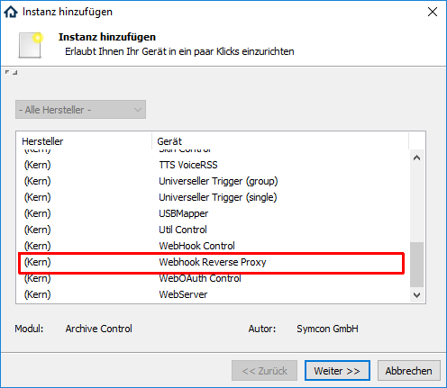
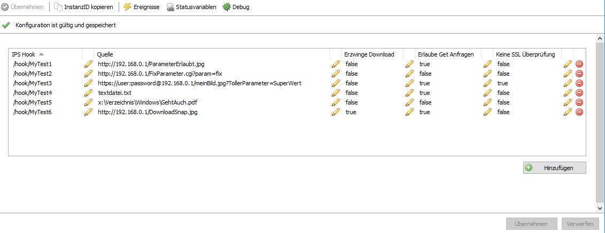

  

  

# Webhook Reverse Proxy
Stellt interne Dateien und URLs als Webhook bereit  

## Dokumentation

**Inhaltsverzeichnis**

1. [Funktionsumfang](#1-funktionsumfang)  
2. [Voraussetzungen](#2-voraussetzungen)  
3. [Software-Installation](#3-software-installation) 
4. [Einrichten der Instanz in IP-Symcon](#4-einrichten-der-instanz-in-ip-symcon)
5. [Statusvariablen und Profile](#5-statusvariablen-und-profile)
6. [WebFront](#6-webfront)
7. [PHP-Befehlsreferenz](#7-php-befehlsreferenz) 
8. [Anhang](#8-anhang)  
    1. [Changelog](#1-changelog)  
9. [Lizenz](#9-lizenz)

## 1. Funktionsumfang

Über Webhooks des IPS-WebServer sind folgende Funktionen realisiert:  
 - Bereitstellung von Lokale Dateien.  
 - Bereitstellung von im lokalen Netzwerk per http/https/ftp erreichbaren Dateien.  
 - Unterstützt Basic & Digist Authentification für die Quellen.
 - Überschreiben und erweitern von Get-Parametern ist möglich.  

## 2. Voraussetzungen

 - IPS 4.3 oder höher  

## 3. Software-Installation

 Dieses Modul ist Bestandteil der [IPSNetwork-Library](../).  

**IPS 5.0:**  
   Bei privater Nutzung: Über das 'Module-Control' in IPS folgende URL hinzufügen.  
    `git://github.com/Nall-chan/IPSNetwork.git`  

   **Bei kommerzieller Nutzung (z.B. als Errichter oder Integrator) wenden Sie sich bitte an den Autor.**  

## 4. Einrichten der Instanz in IP-Symcon

Das Modul ist im Dialog 'Instanz hinzufügen' unter den Kern-Instanzen zu finden.  
  

Folgende Parameter sind in der Instanz zu konfigurieren:  

  
**Konfigurationsseite:**  

Werte pro Spalte:  

| Eigenschaft         | Typ     | Standardwert | Funktion                                                                               |
| :-----------------: | :-----: | :----------: | :------------------------------------------------------------------------------------: |
| Hook                | string  | /hook/       | URI des Webhook. Muss mit /hook/ anfangen.                                             |
| Url                 | string  | http://      | URL zur Quelle. Kann auch https oder eine lokale Datei sein.                           |
| forceDL             | bool    | false        | Zwingt Browser die gelieferten Daten als Datei zu speichern und nicht darzustellen.    |
| allowGet            | bool    | true         | Erlaubt das Erweitern und Überscheiben von Parametern durch den Hook.                  |
| weakSSL             | bool    | false        | Deaktiviert die SSL Prüfung. Zum Beispiel für selbst-signierte Zertifikate.            |

## 5. Statusvariablen und Profile

Dieses Modul legt keine Statusvariablen und Profile an.  

## 6. WebFront

Entfällt.  

## 7. PHP-Befehlsreferenz

Entfällt.  

## 8. Anhang

### 1. Changelog  

Version 2.20:
 - Neu: Webhook Reverse Proxy

Version 2.01:  
 - Doku ergänzt  

Version 2.0:  
 - WebSocket-Module in IPSNetwork überführt  

Version 1.0:  
 - Erstes offizielles Release  

## 9. Lizenz

  IPS-Modul:  
  [CC BY-NC-SA 4.0](https://creativecommons.org/licenses/by-nc-sa/4.0/)  
